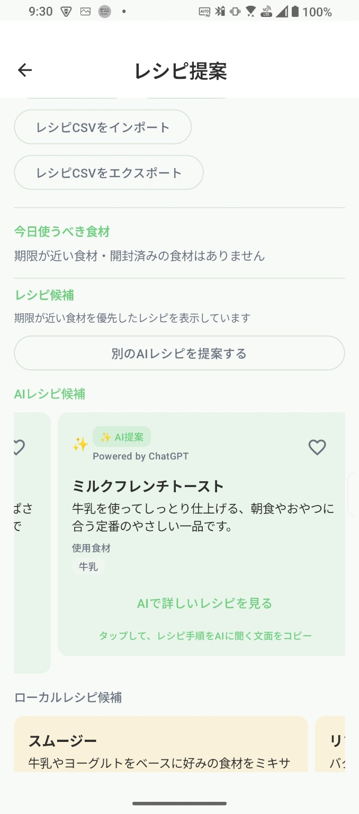

# Mottainai Pantry Web

  

Mottainai Pantry の公式Webサイトです。

家庭の食品ロスを減らすための Android アプリ「Mottainai Pantry」の紹介、プライバシーポリシー、利用規約、サポート情報を掲載します。

## Website

GitHub Pages:

https://shota625.github.io/MottainaiPantry-Web/

## Pages

- [Home](index.html)
- [About](about.html)
- [Download](download.html)
- [Privacy Policy](privacy.html)
- [Terms](terms.html)
- [Support](support.html)
- [FAQ](faq.html)
- [Changelog](changelog.html)

## Screenshots

| Onboarding | Home |
|---|---|
|  |  |

| AI Recipe | Statistics |
|---|---|
|  |  |

## Assets

- `images/app_logo.png`
- `images/app_icon.png`
- `images/screenshot01_onboarding.png`
- `images/screenshot02_home.png`
- `images/screenshot03_ai_recipe.png`
- `images/screenshot04_statistics.png`

## Status

現在は公開前αテスト中です。

- Android版を先行開発中
- iOS版は将来的に検討予定
- Google Play Billingは未実装
- Supporter / Premium は今後対応予定

## License

Personal Project
