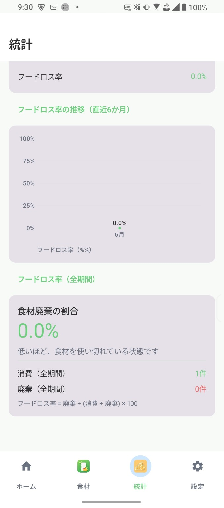

# 🍽️ Mottainai Pantry

  

食品ロスを減らすためのシンプルで使いやすいAndroidアプリ

---

## 📱 アプリ概要

**Mottainai Pantry** は、家庭内の食材を管理し、賞味期限切れや食品ロスを減らすことを目的としたアプリです。

日々の「もったいない」を少しずつ減らし、

> **「食材を最後までおいしく使い切る」**

そんな暮らしをサポートします。

---

## ✨ 主な機能

- 🥬 食材管理
- 📅 賞味期限・消費期限管理
- 📷 賞味期限撮影（OCR）
- 📦 バーコード登録
- 🤖 AIレシピ提案（OpenAI / Gemini）
- 📊 フードロス統計
- ⭐ お気に入りレシピ
- 💾 CSVバックアップ・復元
- 🔒 Android KeystoreによるAPIキー暗号化保存

---

# 📷 スクリーンショット

|オンボーディング|ホーム|
|---|---|
|||

|AIレシピ提案|統計|
|---|---|
|||

---

# 🔒 プライバシー

AI機能を利用する場合は、

**ユーザー自身が取得したAPIキー**

を設定画面から登録します。

APIキーは

- Android Keystore
- AES-GCM

により端末内へ暗号化保存されます。

開発者がAPIキーや食材情報を収集することはありません。

---

# 📄 各種ページ

- 🏠 Home
  - https://shota625.github.io/MottainaiPantry-Web/

- 📖 About
  - https://shota625.github.io/MottainaiPantry-Web/about.html

- 🔒 Privacy Policy
  - https://shota625.github.io/MottainaiPantry-Web/privacy.html

- 📜 Terms of Service
  - https://shota625.github.io/MottainaiPantry-Web/terms.html

- ❓ FAQ
  - https://shota625.github.io/MottainaiPantry-Web/faq.html

- 💬 Support
  - https://shota625.github.io/MottainaiPantry-Web/support.html

- 📥 Download
  - https://shota625.github.io/MottainaiPantry-Web/download.html

- 📝 Changelog
  - https://shota625.github.io/MottainaiPantry-Web/changelog.html

---

# 🚀 Google Play

現在公開準備中です。

公開後はこちらへ掲載予定です。

Coming Soon...

---

# 📧 Contact

ご意見・ご要望・不具合報告は

Supportページよりお願いいたします。

---

# © License

Copyright © 2026 Mottainai Pantry

All Rights Reserved.
